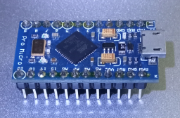
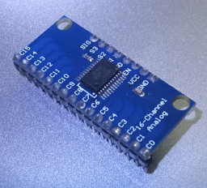
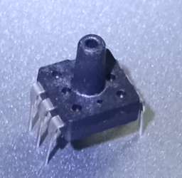
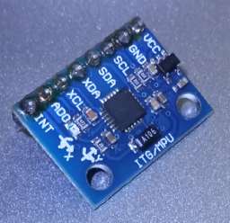
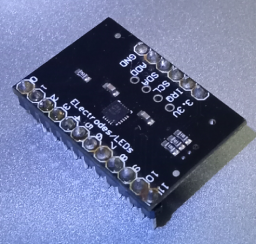
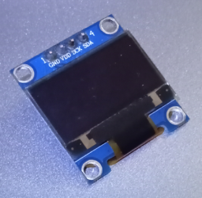

# Components list

[Back](../README.md)

A list to store info about the part.

---

## Components

- Arduino Pro Micro  

- CD74HC4067  

- Breath Sensor  

- GY-521  

- MPR121  

- SSD1306  
[Local Documentation](../Documentation/SSD1306/SSD1306.md)  

