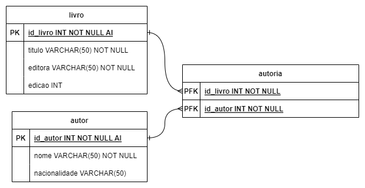
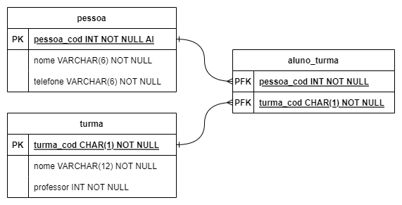

[Back](../Documentation.md)

# Microsoft SQL Server Management Studio

Command to execute previous commands `GO`

Create Database:
```SQL
CREATE DATABASE database_name
```

Select Database:
```SQL
USE database_name
```

Create Independent Table:
```SQL
CREATE TABLE table1(
	id INT PRIMARY KEY IDENTITY(1, 1), /* AutoIncrement id */
	word1 VARCHAR(50) NOT NULL, /* variable size string / obligatory field */
	word2 CHAR(10), /* constant size string / optional field */
	number1 INT /* integer / optional field */
)
```

Create Foreign Key / Composite Key table:
```SQL
CREATE TABLE table3(
	ref1 INT REFERENCES table1(id_from_table1) NOT NULL, /* Foreign Key */
	ref2 CHAR(1) REFERENCES table2(id_from_table2) NOT NULL, /* Foreign Key */
	PRIMARY KEY(ref1, ref2) /* Composite Key */
)
```

Value Insertion:
```SQL
INSERT INTO table1 (field1, field2) VALUES ('text1', 1), ('text2', 2) /* field1 = text / field2 = int */
```

Value Selection:
```SQL
SELECT * FROM table1 /* Selects everything from table1 */
```

---

# Examples

### ex livro



```SQL
CREATE DATABASE livros_2023
GO

USE livros_2023
GO

CREATE TABLE livro(
	id_livro INT PRIMARY KEY IDENTITY(1, 1), 
	titulo VARCHAR(50) NOT NULL,
	editora VARCHAR(50) NOT NULL, 
	edicao INT
)
GO

CREATE TABLE autor(
	id_autor INT PRIMARY KEY IDENTITY(1, 1),
	nome VARCHAR(50) NOT NULL,
	nacionalidade VARCHAR(50)
)
GO

CREATE TABLE autoria(
	id_livro INT REFERENCES livro(id_livro),
	id_autor INT REFERENCES autor(id_autor),
	PRIMARY KEY(id_livro, id_autor)
)
GO
```

### ex turma



```SQL
CREATE DATABASE turmaDB
GO

USE turmaDB
GO

CREATE TABLE pessoa(
	pessoa_cod INT PRIMARY KEY IDENTITY(1, 1),
	nome VARCHAR(6) NOT NULL,
	telefone VARCHAR(6) NOT NULL
)
GO

CREATE TABLE turma(
	turma_cod CHAR(1) PRIMARY KEY NOT NULL,
	nome VARCHAR(12) NOT NULL,
	professor INT NOT NULL
)
GO

CREATE TABLE aluno_turma(
	pessoa_cod INT REFERENCES pessoa(pessoa_cod) NOT NULL,
	turma_cod CHAR(1) REFERENCES turma(turma_cod) NOT NULL,
	PRIMARY KEY(pessoa_cod, turma_cod)
)
GO

INSERT INTO pessoa (nome, telefone) VALUES ('Obilac', '260078'), ('Silva', '282677'), ('Cabral', '260088'), ('Lobato', '174590')
GO

INSERT INTO turma (turma_cod, nome, professor) VALUES ('A', 'Volei 3', 4), ('B', 'Karaté', 4), ('C', 'Natação', 2)
GO

INSERT INTO aluno_turma(pessoa_cod, turma_cod) VALUES (4, 'A'), (2, 'C'), (4, 'B')
GO

SELECT * FROM turma
GO
```

# To See

