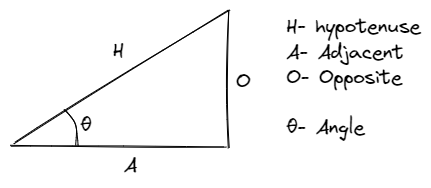
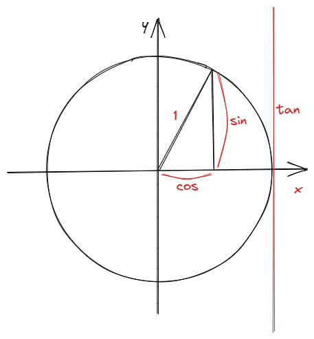
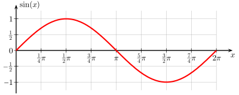
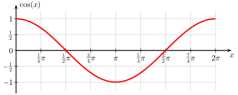
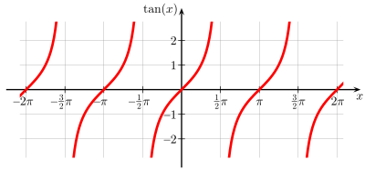
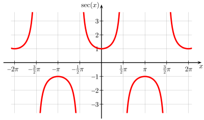
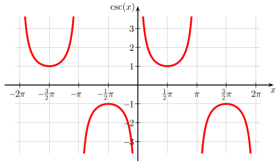
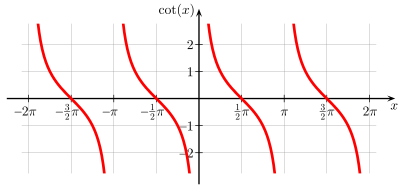

[Back](../Knowledge.md)
# Trigonometry

$\sin \theta$ = $\frac{O}{H}$  

$\cos \theta$ = $\frac{A}{H}$  

$\tan \theta$ = $\frac{O}{A}$  = $\frac{\frac{O}{H}}{\frac{A}{H}}$ = $\frac{\sin \theta}{\cos \theta}$

---

The reciprocals of these functions are named the cosecant (csc), secant (sec), and cotangent (cot)

$\csc \theta$ = $\frac{1}{\sin \theta}$ = $\frac{H}{O}$  

$\sec \theta$ = $\frac{1}{\cos \theta}$ = $\frac{H}{A}$  

$\cot \theta$ = $\frac{1}{\tan \theta}$ = $\frac{\frac{A}{H}}{\frac{O}{H}}$ = $\frac{\cos \theta}{\sin \theta}$ = $\frac{A}{O}$

---

## The unit circle

| Function | 0         | $\frac{\pi}{6}$       | $\frac{\pi}{4}$      | $\frac{\pi}{3}$       | $\frac{\pi}{2}$ | $\frac{2\pi}{3}$      | $\frac{3\pi}{4}$      | $\frac{5\pi}{6}$      | $\pi$     |
| -------- | --------- | --------------------- | -------------------- | --------------------- | --------------- | --------------------- | --------------------- | --------------------- | --------- |
| $\sin$   | 0         | $\frac{1}{2}$         | $\frac{\sqrt{2}}{2}$ | $\frac{\sqrt{3}}{2}$  | 1               | $\frac{\sqrt{3}}{2}$  | $\frac{\sqrt{2}}{2}$  | $\frac{1}{2}$         | 0         |
| $\cos$   | 1         | $\frac{\sqrt{3}}{2}$  | $\frac{\sqrt{2}}{2}$ | $\frac{1}{2}$         | 0               | $-\frac{1}{2}$        | $-\frac{\sqrt{2}}{2}$ | $-\frac{\sqrt{3}}{2}$ | -1        |
| $\tan$   | 0         | $\frac{\sqrt{3}}{3}$  | 1                    | $\sqrt{3}$            | undefined       | $-\sqrt{3}$           | -1                    | $-\frac{\sqrt{3}}{3}$ | 0         |
| $\sec$   | 1         | $\frac{2\sqrt{3}}{3}$ | $\sqrt{2}$           | 2                     | undefined       | -2                    | $-\sqrt{2}$           | $-\frac{\sqrt{3}}{3}$ | -1        |
| $\csc$   | undefined | 2                     | $\sqrt{2}$           | $\frac{2\sqrt{3}}{3}$ | 1               | $\frac{2\sqrt{3}}{3}$ | $\sqrt{2}$            | 2                     | undefined |
| $\cot$   | undefined | $\sqrt{3}$            | 1                    | $\frac{\sqrt{3}}{3}$  | 0               | $-\frac{\sqrt{3}}{3}$ | -1                    | $-\sqrt{3}$           | undefined |

| Function | Period | Domain              | Range   | Graph              |
| -------- | ------ | ------------------- | ------- | ------------------ |
| $\sin$   | $2\pi$ | $]-\infty, \infty[$ | [-1, 1] |  |
| $\cos$   | $2\pi$ | $]-\infty, \infty[$ | [-1, 1] |  |
| $\tan$   | $\pi$ | $x \not ={\frac{\pi}{2} + n\pi}$ | $]-\infty, \infty[$ |  |
| $\sec$   | $2\pi$ | $x \not ={\frac{\pi}{2} + n\pi}$ | $]-\infty, -1] U [1, \infty[$ |  |
| $\csc$   | $2\pi$ | $x \not ={n\pi}$ | $]-\infty, -1] U [1, \infty[$ |  |
| $\cot$   | $\pi$ | $x \not ={n\pi}$ | $]-\infty, \infty[$ |  |
