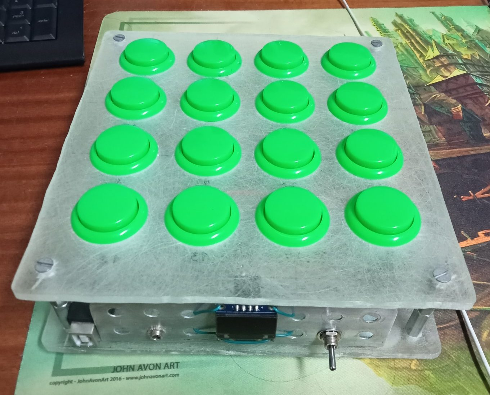
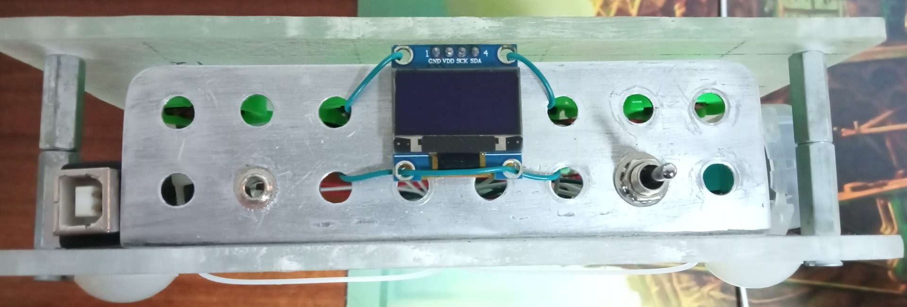
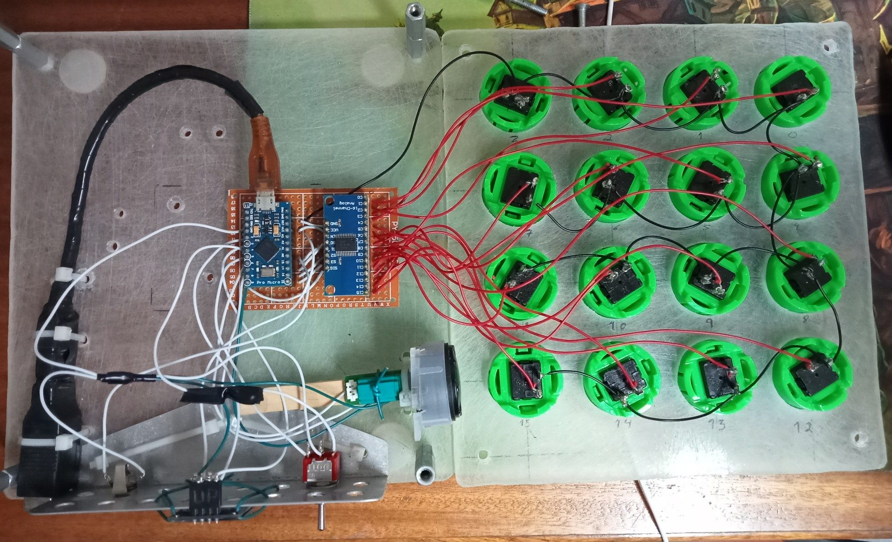
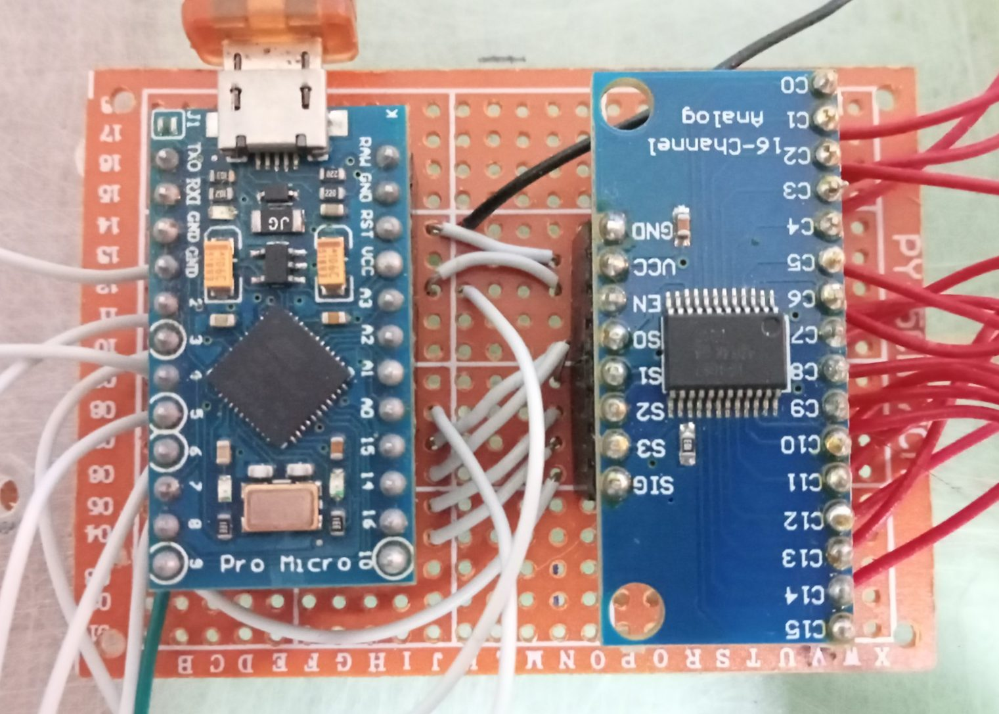

[Back](../README.md)
# MIDI16

A MidiFighter inspired midi controller made with arduino.

---

## Image Showcase
### TopView

---
### FrontView

---
### InsideView

---
### InsideCloseUp

---
## Pin Table

| Arduino | Multiplexer | Jack  | Switch | Screen | Encoder |
| ------- | ----------- | ----- | ------ | ------ | ------- |
| 2       |             |       |        | SDA    |         |
| 3       |             |       |        | SCK    |         |
| 4       |             |       | R      |        |         |
| 5       |             |       | L      |        |         |
| 6       |             |       |        |        |         |
| 7       |             |       |        |        |         |
| 8       |             |       |        |        |         |
| 9       | Sig         |       |        |        |         |
| 10      | S3          |       |        |        |         |
| 16      | S2          |       |        |        |         |
| 14      | S1          |       |        |        |         |
| 15      | S0          |       |        |        |         |
| A0      |             | Point |        |        |         |
| A1      |             |       |        |        |         |
| A2      |             |       |        |        |         |
| A3      |             |       |        |        |         |

